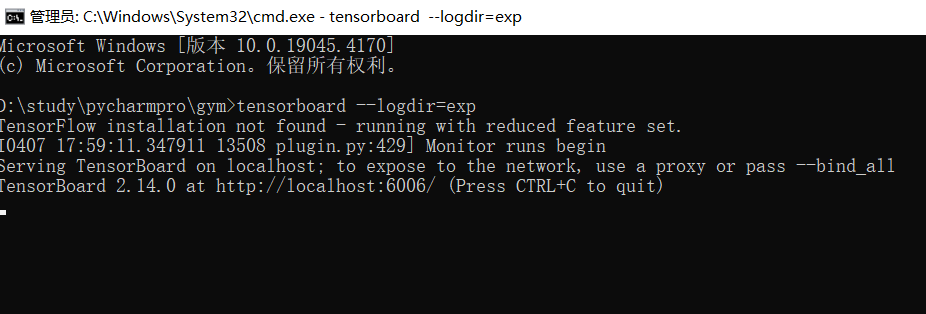
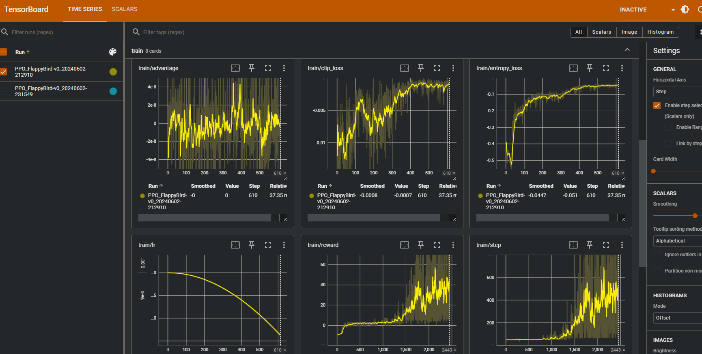
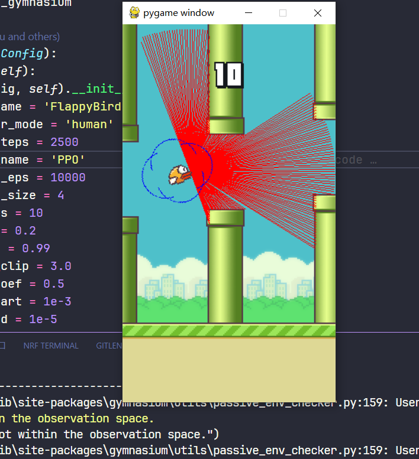

# gymRL
 本人学习强化学习(PPO,DQN,SAC,DDPG等算法)，在gym环境下写的代码集。

 主要研究了PPO和DQN类算法，根据各个论文复现了如下改进:

-  PPO: dual-PPO, clip-PPO, use-RNN, attention, PPG etc.
-  DQN: rainbow DQN

经实验，PPO算法加入LSTM(或GRU)提取时序特征后效果显著，读者可以尝试。

## 算法介绍

### PPO（Proximal Policy Optimization）

PPO是一种策略优化算法，通过限制每次策略更新的幅度来稳定训练过程。

### DQN（Deep Q-Network）

DQN使用深度神经网络来逼近Q值函数，并结合经验回放和固定Q目标来稳定训练。

### SAC（Soft Actor-Critic）

SAC是一种最大化策略熵的算法，旨在提高策略的探索能力。

### DDPG（Deep Deterministic Policy Gradient）

DDPG是一种结合了策略梯度和Q学习的算法，适用于连续动作空间。

### TD3（Twin Delayed DDPG）

TD3是对DDPG的改进，通过延迟更新策略网络和目标网络来减少Q值的过估计。

------

我在离散动作空间的代码探索主要在PPO和PPO+RNN代码进行，读者可以重点关注。

### Tensorboard-SummaryWriter使用

我在**其中一些代码**(PPO, RDQN)加入了tensorboard的使用来获取训练和评估指标，使用方法：

1. 正在运行训练，或等到训练结束，代码运行目录会生成exp文件夹，里面存放了数据文件
2. 代码运行目录下打开命令行窗口，输入：

```cmd
tensorboard --logdir=exp
```

如下图所示：



然后打开http://localhost:6006/ 即可。

可以直观地看到评估和训练的数据图。



如果多条数据线重合在一起影响观看，左边可以取消勾选，如果还是无法解决，建议在exp目录下手动删除不需要的数据文件，然后重启tensorboard即可。理论上eval/reward这条曲线应该是不断上升的，如果不是则需要调参(玄学)。

## 可视化训练

想要在训练过程**直接**观看训练效果的读者，可以在设置里面写：

```python
class Config(BasicConfig):
    def __init__(self):
        super(Config, self).__init__()
        ......
        self.render_mode = 'human' # 默认是"rgb_array"
        .....
```

将其设置成`human`后，可以直接**观看训练过程**：



## 许可证

本项目采用MIT许可证，详见LICENSE。

## 建议

对DQN感兴趣的读者可以使用`CartPole(RDQN)`，即`Rainbow-DQN`。如果是初学者，建议先看`CartPole(DQN)`，这是DQN算法的基本实现，其它如DDQN，PER, DUEL均是在其基础上的改进实验。其中改进最显著的方法是DDQN(double-DQN)，PER和DUEL并不是很显著，并且会降低训练速度，因此读者可以参照只使用DDQN。

对PPO感兴趣的读者可以参考其中PPO以及PPO+RNN的算法，使用了RNN，PSCN等技巧。

对于连续动作空间，最推荐使用的算法是TD3，参考`Pendulum(TD3)`。离散空间`DQN`和`PPO`均可。

## 更新

- 加入torch.jit.script使用，jit优化能显著提升推理速度
- 使用混合精度可优化降低显存使用
- 使用CosineAnnealingLR调整学习率
- 网络可使用RNN(LSTM or GRU)，需继承*BaseRNNModel*
- 使用PReLU替代ReLU，可减少”神经元死亡“现象

