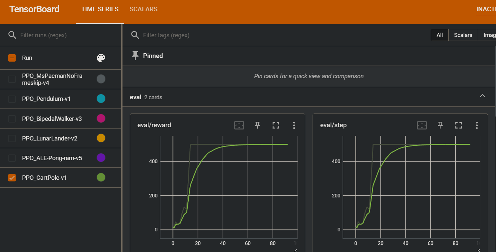

# gymRL
 本人学习强化学习(PPO,DQN,SAC,DDPG等算法)，在gym环境下写的代码集。

 主要研究了PPO和DQN类算法，根据各个论文复现了如下改进:

-  PPO: dual-PPO, clip-PPO, use-RNN, attention etc.
-  DQN: rainbow DQN

在离散动作空间和连续动作空间，PPO算法都奏效，因此我对离散和连续动作空间的代码探索主要在CartPole(PPO), Pendulum(PPO)两份代码进行，读者可以重点关注。
感谢知乎分享：https://zhuanlan.zhihu.com/p/654972230 提出的神经网络构建思路，尤其是其提出的PSCN层：

```python
class PSCN(nn.Module):
    def __init__(self, input_dim, output_dim):
        super(PSCN, self).__init__()
        assert output_dim >= 32 and output_dim % 8 == 0, "output_dim must be >= 32 and divisible by 8 "
        self.hidden_dim = output_dim
        self.fc1 = MLP([input_dim, self.hidden_dim], last_act=True)
        self.fc2 = MLP([self.hidden_dim // 2, self.hidden_dim // 2], last_act=True)
        self.fc3 = MLP([self.hidden_dim // 4, self.hidden_dim // 4], last_act=True)
        self.fc4 = MLP([self.hidden_dim // 8, self.hidden_dim // 8], last_act=True)

    def forward(self, x):
        x = self.fc1(x)

        x1 = x[:, :self.hidden_dim // 2]
        x = x[:, self.hidden_dim // 2:]
        x = self.fc2(x)

        x2 = x[:, :self.hidden_dim // 4]
        x = x[:, self.hidden_dim // 4:]
        x = self.fc3(x)

        x3 = x[:, :self.hidden_dim // 8]
        x = x[:, self.hidden_dim // 8:]
        x4 = self.fc4(x)

        out = torch.cat([x1, x2, x3, x4], dim=1)
        return out
    
# MLP层即封装的全连接层，具体实现请参照utils/model.py
```

个人在这个层的实践过程中效果颇好，读者可以斟酌使用。

### Tensorboard-SummaryWriter使用

我在**其中一些代码**(PPO, RDQN)加入了tensorboard的使用来获取训练和评估指标，使用方法：

1. 正在运行训练，或等到训练结束，代码运行目录会生成exp文件夹，里面存放了数据文件
2. 代码运行目录下打开命令行窗口，输入：

```cmd
tensorboard --logdir=exp
```

如下图所示：


然后打开http://localhost:6006/即可。

可以直观地看到评估和训练的数据图。



如果多条数据线重合在一起影响观看，左边可以取消勾选，如果还是无法解决，建议在exp目录下手动删除不需要的数据文件，然后重启tensorboard即可。理论上eval/reward这条曲线应该是不断上升的，如果不是则需要调参(玄学)。

## 建议

对DQN感兴趣的读者可以使用`CartPole(RDQN)`，即`Rainbow-DQN`。如果是初学者，建议先看`CartPole(DQN)`，这是DQN算法的基本实现，其它如DDQN，PER, DUEL均是在其基础上的改进实验。其中改进最显著的方法是DDQN(double-DQN)，PER和DUEL并不是很显著，并且会降低训练速度，因此读者可以参照只使用DDQN。

对PPO感兴趣的读者可以参考`CartPole(PPO)`以及`Pendulum(PPO)`，分别是在离散动作空间和连续动作空间的PPO实践，使用了RNN，PSCN等技巧。

对于连续动作空间，最推荐使用的算法是TD3，参考`Pendulum(TD3)`。离散空间`DQN`和`PPO`均可。
